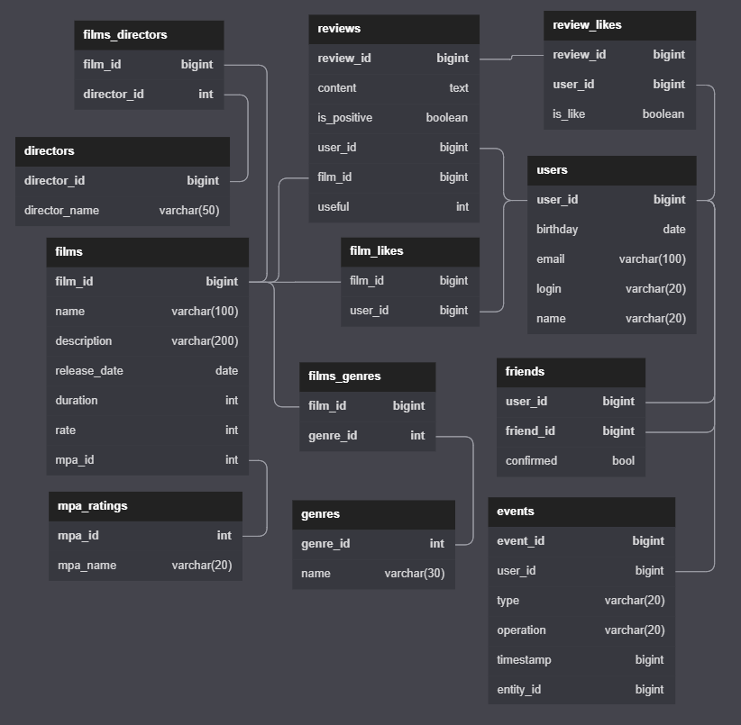

---

# *Java-Filmorate*

Групповой проект по курсу JAVA-developer от [Яндекс-Практикума](https://practicum.yandex.ru/java-developer/).

Описание проекта
-
Приложение представляет собой социальную сеть для просмотра фильмов по своим предпочтениям и рекомендациям друзей.

Использованные технологии:
-

- Java Coretto 11,Maven, Spring-Boot, H2 database, Lombok,JDBC, H2Database,
  RestTemplate

Функционал приложения:
-
Приложение предоставляет возможность:

1. просматривать фильмы
2. оставлять отзывы
3. добавлять лайк\дизлайк фильмам
4. добавлять\удалять друзей
5. просматривать общих друзей
6. просматривать ленту событий по действиям друзей в соц. сети

Личный вклад:
-

1. создание функционала Rest Api для режиссеров: создание режиссеров\получение фильмов с их участием
   [ссылка на ветку add-director](https://github.com/valikaev1989/java-filmorate-group/tree/add-director)
2. получение информации по ленте событий действий друзей в соц. сети
   [ссылка на ветку add-feed](https://github.com/valikaev1989/java-filmorate-group/tree/add-feed)

Инструкция по запуску:
-

1. Для запуска приложения необходимо подключиться базе данных H2:

- Connection type: Embedded
- path: ./db/filmorate.mv.db
- spring.datasource.username=sa
- spring.datasource.password=password

2. База данных в виде диаграммы:   
   